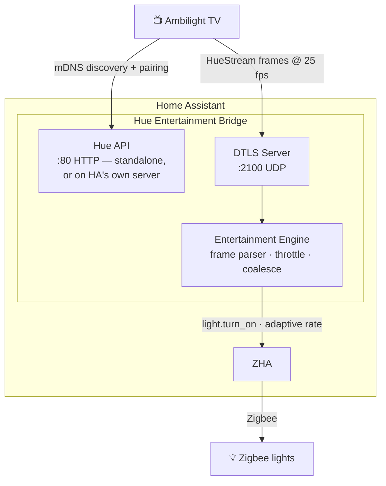

# Hue Entertainment Bridge

[](https://github.com/83noit/ha-hue-entertainment/actions/workflows/tests.yaml)
[](https://github.com/83noit/ha-hue-entertainment/actions/workflows/hacs.yaml)
[](https://github.com/83noit/ha-hue-entertainment/actions/workflows/hassfest.yaml)
[](https://github.com/83noit/ha-hue-entertainment/releases)
[](https://github.com/hacs/default)

A Home Assistant integration that emulates a Philips Hue Bridge's **entertainment mode**, allowing a Hue-compatible TV (Ambilight) to control Zigbee lights managed by [ZHA](https://www.home-assistant.io/integrations/zha/).

Your TV thinks it's talking to a real Hue Bridge. Your Zigbee bulbs change colour in sync with what's on screen.

## How it works



The integration:

1. Advertises a Hue Bridge via mDNS (`_hue._tcp.local`)
2. Serves the Hue v1 REST API for pairing and configuration — on its own port-80 server, or
   through Home Assistant's web server when HA itself listens on port 80 (HA 2026.8+)
3. Accepts DTLS-PSK connections for real-time colour streaming
4. Parses HueStream frames (v1 XY and RGB, v2 RGB)
5. Dispatches colour updates to HA lights via an adaptive drain loop that matches Zigbee throughput
6. Also follows the TV's "classic" per-light commands (no streaming), at the same Zigbee-safe pace

## Features

- **Zero-config pairing** — config flow walks you through light selection and TV pairing
- **Adaptive rate control** — round-robin drain loop with per-light coalescing ensures the Zigbee radio is never overloaded
- **Dynamic transitions** — fade duration automatically matches the update interval for smooth colour changes
- **State snapshot/restore** — lights return to their previous state when entertainment mode ends
- **Watchdog** — auto-stops if the TV disconnects or stops sending frames
- **Classic mode fallback** — if the TV drives lights over plain REST instead of streaming, they still follow
- **No port juggling on HA 2026.8+** — when Home Assistant listens on port 80 the Hue API rides on HA's own web server
- **Resilient** — options apply without a restart, unavailable lights are skipped, bind failures are reported cleanly
- **Diagnostics** — downloadable diagnostics (credentials redacted) and a bridge device grouping the entities
- **Pause / release** — services other automations can call to coordinate Zigbee airtime or an intent change (e.g. a lighting sweep) with the bridge; see below

## Pause, resume, release

The bridge writes to real Zigbee lights, which means it can end up sharing a
radio with — and colliding with — anything else that also controls those
lights: a script sweeping a room's lights off, a firmware update on a nearby
device, anything sending a burst of commands. Three services let another
automation coordinate with the bridge instead of fighting it.

### `hue_entertainment.pause` — a courtesy gap

Suppresses the bridge's effect on its lights for `seconds` (default, or
`seconds: 0`, is a couple of seconds; capped at 30s), then resumes
automatically. Nothing about what these lights should look like has
changed — the session, if any, is left completely alone underneath: frames
or classic-mode commands keep arriving and keep being counted, they're just
not applied. A DTLS handshake or classic command is never blocked by a
pause; only its *effect* on the lights is dropped. Use this for a brief
"let something else get a word in edgewise" gap.

### `hue_entertainment.resume` — end a pause early

Cancels an in-progress pause immediately, before its timer would have. No
effect if nothing is paused, or if a release is already in progress (see
below — release has no early-cancel counterpart of its own).

### `hue_entertainment.release` — an intent change

For when what these lights *should* be doing has actually changed — the
canonical case is a bedtime or arm-away lighting sweep that wants these
lights to switch off and *stay* off, not relight the moment the TV sends
its next frame. Release:

1. Discards the pending restore target immediately. The whole point is that
   whatever the caller just set is now correct — there is nothing to
   restore back to, so a session ending later won't relight the room.
2. Drops frame/command effects immediately, same as pause.
3. Flips the bridge's `stream.active` flag to `false`, so a well-behaved TV
   notices on its next check and disconnects on its own — producing a
   clean, ordinary teardown.
4. If the TV doesn't comply within `seconds` (default/`0` → a couple of
   seconds, capped at 30s), forces the same teardown anyway: the bridge
   simply stops feeding the *existing* dead-stream watchdog, which then
   fires on schedule and tears the session down through the normal path.
   No separate forced-disconnect mechanism exists or is needed — released
   worst-case wait is bounded at `seconds` + the watchdog's own timeout,
   never indefinite.

A new session starting while a release is still pending (the TV
reconnects) *is* the release resolving — it's treated as the old session
ending and a fresh one beginning, with a fresh snapshot, not as "already
active."

### The contract between them

These are documented guarantees, not implementation happenstance — a
caller shouldn't need to know what else might be calling these services to
reason about the outcome:

- **`release` always wins over an in-flight `pause`.** An intent change
  supersedes a courtesy gap; pausing on top of a release and letting the
  pause's own timer later re-enable things would silently undo the release.
- **`pause` is a no-op while a release is in progress.** Effects are
  already suppressed; letting a pause's later auto-expiry interfere with
  the release would be exactly the same problem in reverse.
- **`resume` is a no-op while releasing**, and a no-op if nothing is
  paused. Release has no caller-triggered early-cancel — it resolves via
  the TV reconnecting, or via its own grace-period timeout, never via a
  service call.
- **Calling `pause` again while already paused** resets the timer to a
  fresh `seconds` from the moment of the new call (last call wins), not
  the longer or shorter of the two.
- **Calling `release` again while already releasing** restarts its grace
  period the same way — safe for a caller that isn't sure an earlier call
  landed.

### Observability

`binary_sensor.*_ambilight_active` (entity ID depends on your instance)
answers one question only: is the bridge driving these lights *right now*
— true for both a DTLS stream and classic mode, false while paused or
releasing regardless of what's happening underneath. For *why* it's off —
paused with how much time left, or releasing and whether it's still
waiting politely on the TV or already forcing — see the accompanying
`sensor.*_status` entity, whose state is one of `idle` / `streaming` /
`classic` / `paused` / `releasing`.

## Requirements

- Home Assistant 2024.11+
- [ZHA](https://www.home-assistant.io/integrations/zha/) with colour-capable Zigbee lights
- A Philips TV with Ambilight (or any device that speaks the Hue Entertainment API)
- Port 80 (TCP) and port 2100 (UDP) reachable on the HA host from the TV — the TV hardcodes both

## Installation

### HACS (recommended)

1. Open HACS and go to **Integrations**
2. Search for **Hue Entertainment Bridge** and install
3. Restart Home Assistant

### Manual

1. Copy `custom_components/hue_entertainment/` into your HA config directory
2. Restart Home Assistant

## Setup

1. Go to **Settings > Devices & Services > Add Integration**
2. Search for **Hue Entertainment Bridge**
3. Select the Zigbee lights to include in the entertainment area
4. The pairing wizard starts a 60-second window — trigger a Hue bridge search on your TV
5. Once paired, the integration is ready

## Configuration

Open **Configure** on the integration card to:

- **Change lights** — update which entities are in the entertainment area
- **Pair TV** — open a new 60-second pairing window
- **Bind IP address** — bind the bridge to a specific IP address (see [Port conflicts](#port-conflicts) below)
- **Hue API server** — *Automatic* (default), *Standalone server on port 80*, or *Home Assistant's
  web server*; see [Port conflicts](#port-conflicts) for when each applies

Changes apply immediately — no restart needed. **Download diagnostics** on the same card gives a
redacted snapshot (paired clients, engine counters, options) to attach to bug reports.

## Port conflicts

### Recommended: run Home Assistant itself on port 80 (HA 2026.8+)

Since Home Assistant 2026.8 the frontend can listen on port 80 itself (Settings → System →
Network → *HTTP server port*). When it does — plain HTTP, no certificate — this integration
detects it and serves the Hue API **through Home Assistant's own web server** instead of
starting a second one, so there is no port conflict at all. Nothing to configure; the
*Hue API server* option (Configure → Automatic / Standalone / Home Assistant) exists only to
override the detection. The DTLS stream still uses UDP port 2100 directly.

One HA endpoint overlaps with the Hue API: `GET /api/config`. Unauthenticated requests
(what a Hue client sends) receive the Hue bridge config; requests carrying a Home Assistant
token reach Home Assistant's own handler as before.

If Home Assistant stays on 8123, or serves HTTPS on 443, the integration runs its own server
on port 80. When something else already owns port 80 on the host, pick one of the fallbacks below.

The TV hardcodes port 80 for HTTP and port 2100 for DTLS. Port 80 cannot be changed — this is a Philips Hue protocol requirement, not a limitation of this integration. If something else (Traefik, Nginx, Pi-hole) already occupies port 80 on your HA host, you have two options.

### Fallback A — Secondary IP address (simplest)

Assign a second IP address to your HA host and tell the integration to use it. The bridge binds exclusively to that IP, leaving port 80 on the primary IP free for your reverse proxy.

**Step 1 — assign a secondary IP.**

The exact method depends on your setup. For a Linux host:

```bash
ip addr add 192.168.1.200/24 dev eth0
```

For a permanent alias, add it to your network config (e.g. `/etc/network/interfaces`, Netplan, or your router's DHCP reservations for a macvlan interface).

Docker / HA OS users can create a [macvlan network](https://docs.docker.com/network/drivers/macvlan/) and attach a container with its own IP on the LAN.

**Step 2 — set the Bind IP in the integration.**

Go to **Configure** on the integration card, enter the secondary IP in **Bind IP address**, and save. HA will reload the integration, and the bridge will advertise and listen only on that IP.

> The TV discovers the bridge via mDNS, which will advertise the bind IP automatically — no manual IP configuration needed on the TV.

### Fallback B — iptables redirect

If a secondary IP isn't possible, redirect traffic at the firewall level. This forwards connections arriving on a specific source (e.g. the TV's IP) from port 80 to a high port where the integration listens.

```bash
# Redirect TCP port 80 → 8080 for traffic from the TV
iptables -t nat -A PREROUTING -s <TV_IP> -p tcp --dport 80 -j REDIRECT --to-port 8080
```

Then change the integration's HTTP port to 8080 via the config entry data. This is more fragile (requires knowing the TV's IP statically) and harder to maintain than Fallback A.

## Network requirements

- The TV must reach the HA host on **port 80 (TCP)** and **port 2100 (UDP)**
- If the TV and HA are on different VLANs, **mDNS relay** must be enabled (e.g. Avahi, Unifi mDNS, or a multicast relay) — without it, the TV cannot discover the bridge
- The TV ignores the port advertised by mDNS and always connects to port 80; only the IP address from mDNS is used

## How the adaptive drain loop works

Zigbee radios handle one command per light at a time (~150–200 ms round-trip). At 25 fps input with 4 lights, naive dispatch creates a backlog that grows without bound.

Instead, each incoming frame writes its colour into a per-light slot (newest wins, older frames discarded). A background loop round-robins through the lights, sending one `light.turn_on` call at a time. The transition duration is set dynamically to match the measured inter-update interval, so lights fade smoothly rather than stepping.

With 4 lights on a typical Zigbee coordinator, expect ~5–6 commands/second (~1.5 updates/light/second) with continuous smooth fading.

## Tested with

- Philips 55OLED806/12 (Ambilight, v1 XY frames at 25 fps)
- Home Assistant OS 2026.8 with the frontend on port 80 (Hue API on HA's server) and on 8123 (standalone)
- SLZB-06Mg24 Zigbee coordinator (TCP, via ZHA)
- Various Zigbee colour bulbs

## Troubleshooting

**TV doesn't find the bridge**
- If the integration card says *Failed to set up* / *Retrying*, port 80 is taken on the HA host —
  see [Port conflicts](#port-conflicts). `curl http://<HA_IP>/api/nouser/config` must return the bridge JSON.
- Verify mDNS works across VLANs if the TV is on a separate network segment
- Check HA logs for mDNS registration errors

**TV says the bulbs are connected but they barely follow, or lag a lot**
- The TV has fallen into "classic" mode (per-light REST commands, ~4 updates/s shared by all bulbs,
  no DTLS stream). This happens when the bridge disappears while the TV is on — e.g. an HA restart.
  Toggling Ambilight+hue does not fix it; **restart the TV** and it will stream again (allow 2–3
  minutes for it to rediscover the bridge).

**Lights don't change colour**
- Confirm the selected lights are ZHA colour-capable entities (`color_mode: xy` or `hs`)
- Check port 2100 (UDP) is reachable from the TV: `nc -u <HA_IP> 2100`
- Enable debug logging:
  ```yaml
  logger:
    logs:
      custom_components.hue_entertainment: debug
  ```

**Colours are behind / out of sync**
- This is normal for Zigbee — the adaptive drain loop minimises lag but Zigbee throughput is the hard limit (~1.5 updates/light/second with 4 lights)
- Reducing the number of lights in the entertainment area increases the per-light update rate

## License

MIT
