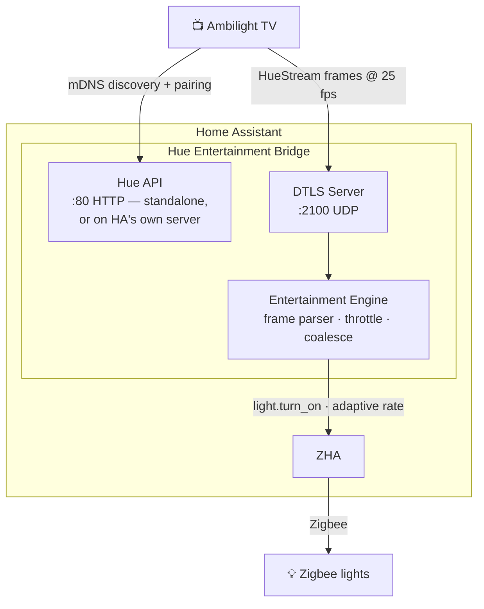

# Hue Entertainment Bridge

[](https://github.com/83noit/ha-hue-entertainment/actions/workflows/tests.yaml)
[](https://github.com/83noit/ha-hue-entertainment/actions/workflows/hacs.yaml)
[](https://github.com/83noit/ha-hue-entertainment/actions/workflows/hassfest.yaml)
[](https://github.com/83noit/ha-hue-entertainment/releases)
[](https://github.com/hacs/default)

A Home Assistant integration that emulates a Philips Hue Bridge's **entertainment mode**, allowing a Hue-compatible TV (Ambilight) to control Zigbee lights managed by [ZHA](https://www.home-assistant.io/integrations/zha/).

Your TV thinks it's talking to a real Hue Bridge. Your Zigbee bulbs change colour in sync with what's on screen.

## How it works



The integration:

1. Advertises a Hue Bridge via mDNS (`_hue._tcp.local`)
2. Serves the Hue v1 REST API for pairing and configuration — on its own port-80 server, or
   through Home Assistant's web server when HA itself listens on port 80 (HA 2026.8+)
3. Accepts DTLS-PSK connections for real-time colour streaming
4. Parses HueStream frames (v1 XY and RGB, v2 RGB)
5. Dispatches colour updates to HA lights via an adaptive drain loop that matches Zigbee throughput
6. Also follows the TV's "classic" per-light commands (no streaming), at the same Zigbee-safe pace

## Features

- **Zero-config pairing** — config flow walks you through light selection and TV pairing
- **Adaptive rate control** — round-robin drain loop with per-light coalescing ensures the Zigbee radio is never overloaded
- **Dynamic transitions** — fade duration automatically matches the update interval for smooth colour changes
- **State snapshot/restore** — lights return to their previous state when entertainment mode ends
- **Watchdog** — auto-stops if the TV disconnects or stops sending frames
- **Classic mode fallback** — if the TV drives lights over plain REST instead of streaming, they still follow
- **No port juggling on HA 2026.8+** — when Home Assistant listens on port 80 the Hue API rides on HA's own web server
- **Resilient** — options apply without a restart, unavailable lights are skipped, bind failures are reported cleanly
- **Diagnostics** — downloadable diagnostics (credentials redacted) and a bridge device grouping the entities
- **Pause / release** — services your automations call to coordinate Zigbee airtime, or a lighting sweep, with the bridge

## Pause, resume, release

Three services let your own automations coordinate with the bridge instead of fighting it
for the Zigbee radio:

- **`hue_entertainment.pause`** — a courtesy gap: drop the bridge's effect on its lights for a few
  seconds (max 30), then carry on. The session is untouched.
- **`hue_entertainment.resume`** — end a pause early.
- **`hue_entertainment.release`** — an intent change, e.g. a bedtime sweep that wants the lights
  off and *staying* off: forgets the pre-session state so nothing relights the room, asks the TV
  to stop, and forces a clean teardown if it doesn't within the grace period. An optional
  `settle_seconds` blocks the call briefly before returning, for a caller whose own sweep runs
  immediately after.

```yaml
- action: hue_entertainment.release
  data:
    seconds: 3
- action: light.turn_off
  target:
    area_id: living_room
```

Two entities under the bridge device show what's going on: **Ambilight active** (is the bridge
driving the lights right now) and a diagnostic **Status** sensor (`idle` / `streaming` /
`classic` / `paused` / `releasing`). Full contract, examples and edge cases:
[docs/pause-release.md](docs/pause-release.md).

## Requirements

- Home Assistant 2024.11+
- [ZHA](https://www.home-assistant.io/integrations/zha/) with colour-capable Zigbee lights
- A Philips TV with Ambilight (or any device that speaks the Hue Entertainment API)
- Port 80 (TCP) and port 2100 (UDP) reachable on the HA host from the TV — the TV hardcodes both

## Installation

### HACS (recommended)

1. Open HACS and go to **Integrations**
2. Search for **Hue Entertainment Bridge** and install
3. Restart Home Assistant

### Manual

1. Copy `custom_components/hue_entertainment/` into your HA config directory
2. Restart Home Assistant

## Setup

1. Go to **Settings > Devices & Services > Add Integration**
2. Search for **Hue Entertainment Bridge**
3. Select the Zigbee lights to include in the entertainment area
4. The pairing wizard starts a 60-second window — trigger a Hue bridge search on your TV
5. Once paired, the integration is ready

## Configuration

Open **Configure** on the integration card to:

- **Change lights** — update which entities are in the entertainment area
- **Pair TV** — open a new 60-second pairing window
- **Bind IP address** — bind the bridge to a specific IP address (see [Port conflicts](#port-conflicts) below)
- **Hue API server** — *Automatic* (default), *Standalone server on port 80*, or *Home Assistant's
  web server*; see [Port conflicts](#port-conflicts) for when each applies

Changes apply immediately — no restart needed. **Download diagnostics** on the same card gives a
redacted snapshot (paired clients, engine counters, options) to attach to bug reports.

## Port conflicts

The TV hardcodes port 80 (HTTP) and 2100 (DTLS). On **HA 2026.8+ with the frontend on port 80**
the Hue API is served through Home Assistant's own web server and there is no conflict — nothing
to configure. Otherwise the integration runs its own server on port 80; if something else
(Traefik, Nginx, Pi-hole) already owns it, bind the bridge to a secondary IP address or redirect
the TV's traffic with iptables. Both are walked through in
[docs/port-conflicts.md](docs/port-conflicts.md).

## Network requirements

- The TV must reach the HA host on **port 80 (TCP)** and **port 2100 (UDP)**
- If the TV and HA are on different VLANs, **mDNS relay** must be enabled (e.g. Avahi, Unifi mDNS, or a multicast relay) — without it, the TV cannot discover the bridge
- The TV ignores the port advertised by mDNS and always connects to port 80; only the IP address from mDNS is used

## How the adaptive drain loop works

Zigbee radios handle one command per light at a time (~150–200 ms round-trip). At 25 fps input with 4 lights, naive dispatch creates a backlog that grows without bound.

Instead, each incoming frame writes its colour into a per-light slot (newest wins, older frames discarded). A background loop round-robins through the lights, sending one `light.turn_on` call at a time. The transition duration is set dynamically to match the measured inter-update interval, so lights fade smoothly rather than stepping.

With 4 lights on a typical Zigbee coordinator, expect ~5–6 commands/second (~1.5 updates/light/second) with continuous smooth fading.

## Tested with

- Philips 55OLED806/12 (Ambilight, v1 XY frames at 25 fps)
- Home Assistant OS 2026.8 with the frontend on port 80 (Hue API on HA's server) and on 8123 (standalone)
- SLZB-06Mg24 Zigbee coordinator (TCP, via ZHA)
- Various Zigbee colour bulbs

## Troubleshooting

**TV doesn't find the bridge**
- If the integration card says *Failed to set up* / *Retrying*, port 80 is taken on the HA host —
  see [Port conflicts](#port-conflicts). `curl http://<HA_IP>/api/nouser/config` must return the bridge JSON.
- Verify mDNS works across VLANs if the TV is on a separate network segment
- Check HA logs for mDNS registration errors

**TV says the bulbs are connected but they barely follow, or lag a lot**
- The TV has fallen into "classic" mode (per-light REST commands, ~4 updates/s shared by all bulbs,
  no DTLS stream). This happens when the bridge disappears while the TV is on — e.g. an HA restart.
  Toggling Ambilight+hue does not fix it; **restart the TV** and it will stream again (allow 2–3
  minutes for it to rediscover the bridge).

**Lights don't change colour**
- Confirm the selected lights are ZHA colour-capable entities (`color_mode: xy` or `hs`)
- Check port 2100 (UDP) is reachable from the TV: `nc -u <HA_IP> 2100`
- Enable debug logging:
  ```yaml
  logger:
    logs:
      custom_components.hue_entertainment: debug
  ```

**Colours are behind / out of sync**
- This is normal for Zigbee — the adaptive drain loop minimises lag but Zigbee throughput is the hard limit (~1.5 updates/light/second with 4 lights)
- Reducing the number of lights in the entertainment area increases the per-light update rate

## License

MIT
